<p align="center">
  
</p>

<h2 align="center">Manage Claude Code sessions better than ever</h2>

<p align="center">
  Autonomous Claude Code work while you sleep<br>
  <em>Persistent sessions, Ralph Loop tracking, Respawn Controller, Agent Visualization, Multi-Session Dashboards</em>
</p>

<p align="center">
  <a href="https://opensource.org/licenses/MIT"></a>
  <a href="https://nodejs.org/"></a>
  <a href="https://www.typescriptlang.org/"></a>
  <a href="https://fastify.dev/"></a>
  
</p>

---

<p align="center">
  
</p>

<p align="center">
  
</p>

---

## What Claudeman Does

### 🔔 Notification System

Real-time desktop notifications when sessions need attention — never miss a permission prompt or idle session again:

| Hook Event | Urgency | Tab Alert | Meaning |
|------------|---------|-----------|---------|
| `permission_prompt` | Critical | Red blink | Claude needs tool approval |
| `elicitation_dialog` | Critical | Red blink | Claude is asking a question |
| `idle_prompt` | Warning | Yellow blink | Session idle, waiting for input |
| `stop` | Info | — | Response complete |

**Features:**
- Browser notifications enabled by default (auto-requests permission)
- Click any notification to jump directly to the affected session
- Tab blinking alerts: red for action-required, yellow for idle
- Notifications include actual context (tool name, command, question text)
- Hooks are auto-configured per case directory (`.claude/settings.local.json`)
- Works on HTTP for local use (localhost is a secure context)

---

### 💾 Persistent Screen Sessions

Every Claude session runs inside **GNU Screen** — sessions survive server restarts, network drops, and machine sleep.

```bash
# Your sessions are always recoverable
CLAUDEMAN_SCREEN=1
CLAUDEMAN_SESSION_ID=abc-123-def
CLAUDEMAN_SCREEN_NAME=claudeman-myproject
```

- Sessions auto-recover on startup (dual redundancy: `state.json` + `screens.json`)
- All settings (respawn, auto-compact, tokens) survive server restarts
- Ghost session discovery finds orphaned screens
- Claude knows it's managed (won't kill its own screen)

---

### 🔄 Respawn Controller

**The core of autonomous work.** When Claude becomes idle, the Respawn Controller kicks in:

```
WATCHING → IDLE DETECTED → SEND UPDATE → CLEAR → INIT → CONTINUE
    ↑                                                      │
    └──────────────────────────────────────────────────────┘
```

- Multi-layer idle detection (completion messages, output silence, token stability)
- Sends configurable update prompts to continue work
- Auto-cycles `/clear` → `/init` for fresh context
- Step confirmation (5s silence) between each command
- **Keeps working even when Ralph loops stop**
- Run for **24+ hours** completely unattended

```bash
# Enable respawn with 8-hour timer
curl -X POST localhost:3000/api/sessions/:id/respawn/enable \
  -H "Content-Type: application/json" \
  -d '{
    "config": {
      "updatePrompt": "continue improving the codebase",
      "idleTimeoutMs": 5000
    },
    "durationMinutes": 480
  }'
```

---

### 🎯 Ralph / Todo Tracking

Claudeman detects and tracks Ralph Loops and Todos inside Claude Code:

<p align="center">
  
</p>

**Auto-detects:**
| Pattern | Example |
|---------|---------|
| Promise tags | `<promise>COMPLETE</promise>` |
| Custom phrases | `<promise>ALL_TASKS_DONE</promise>` |
| TodoWrite | `- [ ] Task`, `- [x] Done` |
| Iterations | `[5/50]`, `Iteration 5 of 50` |

**Tracks in real-time:**
- Completion phrase detection
- Todo progress (`4/9 complete`)
- Progress percentage ring
- Elapsed time

---

### 🤖 Spawn1337: Autonomous Agent Protocol

Spawn full-power Claude agents that run independently in their own screen sessions:

```
Parent Session → <spawn1337>task.md</spawn1337>
  → SpawnDetector parses tag
  → Orchestrator creates agent directory
  → Spawns Claude in its own screen session
  → Agent works autonomously
  → Reports result via <promise>PHRASE</promise>
  → Parent notified via SSE
```

**Features:**
- **Resource governance**: Budget limits (tokens + cost), timeout enforcement, graceful shutdown
- **Agent trees**: Agents can spawn children (max depth: 3)
- **Communication**: Filesystem-based message bus between parent and child
- **Max 5 concurrent** agents with queuing for overflow

```yaml
# Task spec format (YAML frontmatter in .md file)
---
agentId: my-agent-001
name: My Agent
type: implement
priority: high
maxTokens: 150000
maxCost: 0.50
timeoutMinutes: 15
completionPhrase: AGENT_DONE
---
Implement the feature described below...
```

---

### 👁️ Live Agent Visualization

**Watch your agents work in real-time.** Claudeman monitors Claude Code's background agents (the `Task` tool) and displays them in draggable floating windows with Matrix-style connection lines.

```
┌─────────────────────────────────────────────────────────────┐
│  Session Tab [AGENTS (3)]                                   │
│      │                                                      │
│      │ ╭──────────────────╮  ╭──────────────────╮          │
│      ├─┤ Agent: explore   │  │ Agent: implement │          │
│      │ │ ● active         │  │ ○ completed      │          │
│      │ │ Tool: Grep       │  │ Result: success  │          │
│      │ ╰──────────────────╯  ╰──────────────────╯          │
│      │         ╭──────────────────╮                        │
│      └─────────┤ Agent: test      │                        │
│                │ ◐ idle           │                        │
│                ╰──────────────────╯                        │
└─────────────────────────────────────────────────────────────┘
```

**Features:**
- **Floating windows** — Draggable, resizable panels for each agent
- **Connection lines** — Animated green lines linking parent sessions to agent windows
- **Live activity log** — See every tool call, progress update, and message in real-time
- **Status indicators** — Green (active), yellow (idle), blue (completed)
- **Model badges** — Shows Haiku/Sonnet/Opus with color coding
- **Auto-behavior** — Windows auto-open on spawn, auto-minimize on completion
- **Tab badge** — Shows "AGENT" or "AGENTS (n)" count on session tabs

**Subagent API:**
| Method | Endpoint | Description |
|--------|----------|-------------|
| `GET` | `/api/subagents` | List all background agents |
| `GET` | `/api/subagents/:id` | Agent info and status |
| `GET` | `/api/subagents/:id/transcript` | Full activity transcript |
| `DELETE` | `/api/subagents/:id` | Kill agent process |

---

### 🔍 Project Insights Panel

Real-time visibility into what Claude is reading and searching:

- **Active Bash tools** displayed as they run (file viewers, grep, find)
- **Clickable file paths** — Jump directly to files in Claude Code
- **Timeout indicators** — See how long tools have been running
- **Smart deduplication** — Overlapping file ranges collapsed

Toggle via App Settings → Display → "Show Project Insights Panel"

---

### 📊 Smart Token Management

Never hit token limits unexpectedly:

| Threshold | Action | Result |
|-----------|--------|--------|
| **110k tokens** | Auto `/compact` | Context summarized, work continues |
| **140k tokens** | Auto `/clear` | Fresh start with `/init` |

```bash
# Configure per-session
curl -X POST localhost:3000/api/sessions/:id/auto-compact \
  -d '{"enabled": true, "threshold": 100000}'
```

---

### 🖥️ Multi-Session Dashboard

Run **20 parallel sessions** with full visibility:

- Real-time xterm.js terminals (60fps streaming)
- Per-session token and cost tracking
- Tab-based navigation
- One-click session management

<p align="center">
  
</p>

**Monitor Panel** — Real-time screen session monitoring with memory, CPU, and process info:

<p align="center">
  
</p>

---

### 📈 Run Summary ("What Happened While You Were Away")

Click the chart icon on any session tab to see a complete timeline of what happened:

**Tracked Events:**
- Session start/stop and respawn cycles
- Idle/working transitions with durations
- Token milestones (every 50k tokens)
- Auto-compact and auto-clear triggers
- Ralph Loop completions
- AI check results (idle detection verdicts)
- Hook events (permissions, questions, stops)
- Errors, warnings, and stuck-state alerts

**Stats at a glance:**
- Total respawn cycles
- Peak token usage
- Active vs idle time
- Error/warning counts

---

## Installation

### macOS & Linux

```bash
curl -fsSL https://raw.githubusercontent.com/Ark0N/claudeman/master/install.sh | bash
```

### npm (alternative)

```bash
npm install -g claudeman
```

### Requirements

- Node.js 18+
- [Claude CLI](https://docs.anthropic.com/en/docs/claude-code/getting-started) installed
- GNU Screen (`apt install screen` / `brew install screen`)

## Getting Started

```bash
claudeman web
# Open http://localhost:3000
# Press Ctrl+Enter to start your first session
```

> **Note:** HTTP works fine for local use since `localhost` is treated as a secure context by browsers. Use `--https` only when accessing from another machine on your network.

---

## Keyboard Shortcuts

| Shortcut | Action |
|----------|--------|
| `Ctrl+Enter` | Quick-start session |
| `Ctrl+W` | Close session |
| `Ctrl+Tab` | Next session |
| `Ctrl+K` | Kill all sessions |
| `Ctrl+L` | Clear terminal |

---

## API

### Sessions
| Method | Endpoint | Description |
|--------|----------|-------------|
| `GET` | `/api/sessions` | List all |
| `POST` | `/api/quick-start` | Create case + start session |
| `DELETE` | `/api/sessions/:id` | Delete session |
| `POST` | `/api/sessions/:id/input` | Send input |

### Respawn
| Method | Endpoint | Description |
|--------|----------|-------------|
| `POST` | `/api/sessions/:id/respawn/enable` | Enable with config + timer |
| `POST` | `/api/sessions/:id/respawn/stop` | Stop controller |
| `PUT` | `/api/sessions/:id/respawn/config` | Update config |

### Ralph / Todo Tracking
| Method | Endpoint | Description |
|--------|----------|-------------|
| `GET` | `/api/sessions/:id/ralph-state` | Get loop state + todos |
| `POST` | `/api/sessions/:id/ralph-config` | Configure tracking |

### Spawn Agents
| Method | Endpoint | Description |
|--------|----------|-------------|
| `GET` | `/api/spawn/agents` | List all agents |
| `GET` | `/api/spawn/agents/:id` | Agent status + progress |
| `GET` | `/api/spawn/agents/:id/result` | Agent result |
| `POST` | `/api/spawn/agents/:id/message` | Send message to agent |
| `POST` | `/api/spawn/agents/:id/cancel` | Cancel agent |
| `POST` | `/api/spawn/trigger` | Programmatic spawn |

### Subagents (Claude Code Background Agents)
| Method | Endpoint | Description |
|--------|----------|-------------|
| `GET` | `/api/subagents` | List all background agents |
| `GET` | `/api/subagents/:id` | Agent info and status |
| `GET` | `/api/subagents/:id/transcript` | Full activity transcript |
| `DELETE` | `/api/subagents/:id` | Kill agent process |
| `GET` | `/api/sessions/:id/subagents` | Subagents for session's working dir |

### Hooks & Notifications
| Method | Endpoint | Description |
|--------|----------|-------------|
| `POST` | `/api/hook-event` | Hook callbacks `{event, sessionId, data?}` → notifications + tab alerts |

### Run Summary
| Method | Endpoint | Description |
|--------|----------|-------------|
| `GET` | `/api/sessions/:id/run-summary` | Timeline + stats for "what happened" |

### Real-Time
| Method | Endpoint | Description |
|--------|----------|-------------|
| `GET` | `/api/events` | SSE stream |
| `GET` | `/api/status` | Full app state |

---

## Architecture

```mermaid
flowchart TB
    subgraph Claudeman["🖥️ CLAUDEMAN"]
        subgraph Frontend["Frontend Layer"]
            UI["Web UI<br/><small>xterm.js + Agent Windows</small>"]
            API["REST API<br/><small>Fastify</small>"]
            SSE["SSE Events<br/><small>/api/events</small>"]
        end

        subgraph Core["Core Layer"]
            SM["Session Manager"]
            S1["Session (PTY)"]
            S2["Session (PTY)"]
            RC["Respawn Controller"]
            SO["Spawn Orchestrator"]
        end

        subgraph Detection["Detection Layer"]
            RT["Ralph Tracker"]
            SD["Spawn Detector"]
            SW["Subagent Watcher<br/><small>~/.claude/projects/*/subagents</small>"]
        end

        subgraph Persistence["Persistence Layer"]
            SCR["GNU Screen Manager"]
            SS["State Store<br/><small>state.json</small>"]
        end

        subgraph External["External"]
            CLI["Claude CLI"]
            A1["Agent 1<br/><small>(screen)</small>"]
            A2["Agent 2<br/><small>(screen)</small>"]
            BG["Background Agents<br/><small>(Task tool)</small>"]
        end
    end

    UI <--> API
    API <--> SSE
    API --> SM
    SM --> S1
    SM --> S2
    SM --> RC
    SM --> SS
    S1 --> RT
    S1 --> SD
    SD --> SO
    SO --> A1
    SO --> A2
    S1 --> SCR
    S2 --> SCR
    RC --> SCR
    SCR --> CLI
    SW --> BG
    SW --> SSE
```



---

## Performance

Optimized for long-running autonomous sessions:

| Feature | Implementation |
|---------|----------------|
| **60fps terminal** | 16ms server batching, `requestAnimationFrame` client |
| **Memory management** | Auto-trimming buffers (2MB terminal, 1MB text) |
| **Event debouncing** | 50-500ms on rapid state changes |
| **State persistence** | Debounced writes, dual-redundancy recovery |

---

## Development

```bash
npm install
npx tsx src/index.ts web    # Dev mode
npm run build               # Production build
npm test                    # Run tests
```

See [CLAUDE.md](./CLAUDE.md) for full documentation.

---

## License

MIT — see [LICENSE](LICENSE)

---

<p align="center">
  <strong>Track sessions. Visualize agents. Control respawn. Let it run while you sleep.</strong>
</p>
