<p align="center">
  
</p>

<h2 align="center">Manage Claude Code sessions better than ever</h2>

<p align="center">
  Autonomous Claude Code work while you sleep<br>
  <em>Persistent sessions, Ralph Loop tracking, Respawn Controller, Multi-Session Dashboards, Monitor Panel</em>
</p>

<p align="center">
  <a href="https://opensource.org/licenses/MIT"></a>
  <a href="https://nodejs.org/"></a>
  <a href="https://www.typescriptlang.org/"></a>
  <a href="https://fastify.dev/"></a>
  
</p>

---

<p align="center">
  
</p>

<p align="center">
  
</p>

---

## What Claudeman Does

### 💾 Persistent Screen Sessions

Every Claude session runs inside **GNU Screen** — sessions survive server restarts, network drops, and machine sleep.

```bash
# Your sessions are always recoverable
CLAUDEMAN_SCREEN=1
CLAUDEMAN_SESSION_ID=abc-123-def
CLAUDEMAN_SCREEN_NAME=claudeman-myproject
```

- Sessions auto-recover on startup
- Ghost session discovery finds orphaned screens
- Claude knows it's managed (won't kill its own screen)

---

### 🔄 Respawn Controller

**The core of autonomous work.** When Claude becomes idle, the Respawn Controller kicks in:

```
WATCHING → IDLE DETECTED → SEND UPDATE → CLEAR → INIT → CONTINUE
    ↑                                                      │
    └──────────────────────────────────────────────────────┘
```

- Detects idle state via prompt indicators (`↵ send`, `❯`)
- Sends configurable update prompts to continue work
- Auto-cycles `/clear` → `/init` for fresh context
- **Keeps working even when Ralph loops stop**
- Run for **24+ hours** completely unattended

```bash
# Enable respawn with 8-hour timer
curl -X POST localhost:3000/api/sessions/:id/respawn/enable \
  -H "Content-Type: application/json" \
  -d '{
    "config": {
      "updatePrompt": "continue improving the codebase",
      "idleTimeoutMs": 5000
    },
    "durationMinutes": 480
  }'
```

---

### 🎯 Ralph / Todo Tracking

Claudeman detects and tracks Ralph Loops and Todos inside Claude Code:

<p align="center">
  
</p>

**Auto-detects:**
| Pattern | Example |
|---------|---------|
| Promise tags | `<promise>COMPLETE</promise>` |
| Custom phrases | `<promise>ALL_TASKS_DONE</promise>` |
| TodoWrite | `- [ ] Task`, `- [x] Done` |
| Iterations | `[5/50]`, `Iteration 5 of 50` |

**Tracks in real-time:**
- Completion phrase detection
- Todo progress (`4/9 complete`)
- Progress percentage ring
- Elapsed time

---

### 📊 Smart Token Management

Never hit token limits unexpectedly:

| Threshold | Action | Result |
|-----------|--------|--------|
| **110k tokens** | Auto `/compact` | Context summarized, work continues |
| **140k tokens** | Auto `/clear` | Fresh start with `/init` |

```bash
# Configure per-session
curl -X POST localhost:3000/api/sessions/:id/auto-compact \
  -d '{"enabled": true, "threshold": 100000}'
```

---

### 🖥️ Multi-Session Dashboard

Run **20 parallel sessions** with full visibility:

- Real-time xterm.js terminals (60fps streaming)
- Per-session token and cost tracking
- Tab-based navigation
- One-click session management

<p align="center">
  
</p>

**Monitor Panel** — Real-time screen session monitoring with memory, CPU, and process info:

<p align="center">
  
</p>

---

## Quick Start

```bash
# Clone and build
git clone https://github.com/Ark0N/claudeman.git
cd claudeman
npm install && npm run build

# Start the web interface
claudeman web

# Open http://localhost:3000
# Press Ctrl+Enter to start your first session
```

### More Options

```bash
# Custom port
claudeman web -p 8080

# Development mode (no build needed)
npx tsx src/index.ts web
```

**Requirements:**
- Node.js 18+
- Claude CLI in PATH
- GNU Screen (`apt install screen` / `brew install screen`)

---

## Keyboard Shortcuts

| Shortcut | Action |
|----------|--------|
| `Ctrl+Enter` | Quick-start session |
| `Ctrl+W` | Close session |
| `Ctrl+Tab` | Next session |
| `Ctrl+K` | Kill all sessions |
| `Ctrl+L` | Clear terminal |

---

## API

### Sessions
| Method | Endpoint | Description |
|--------|----------|-------------|
| `GET` | `/api/sessions` | List all |
| `POST` | `/api/quick-start` | Create case + start session |
| `DELETE` | `/api/sessions/:id` | Delete session |
| `POST` | `/api/sessions/:id/input` | Send input |

### Respawn
| Method | Endpoint | Description |
|--------|----------|-------------|
| `POST` | `/api/sessions/:id/respawn/enable` | Enable with config + timer |
| `POST` | `/api/sessions/:id/respawn/stop` | Stop controller |
| `PUT` | `/api/sessions/:id/respawn/config` | Update config |

### Ralph / Todo Tracking
| Method | Endpoint | Description |
|--------|----------|-------------|
| `GET` | `/api/sessions/:id/ralph-state` | Get loop state + todos |
| `POST` | `/api/sessions/:id/ralph-config` | Configure tracking |

### Real-Time
| Method | Endpoint | Description |
|--------|----------|-------------|
| `GET` | `/api/events` | SSE stream |
| `GET` | `/api/status` | Full app state |

---

## Architecture

```mermaid
flowchart TB
    subgraph Claudeman["🖥️ CLAUDEMAN"]
        subgraph Frontend["Frontend Layer"]
            UI["Web UI<br/><small>xterm.js</small>"]
            API["REST API<br/><small>Fastify</small>"]
            SSE["SSE Events<br/><small>/api/events</small>"]
        end

        subgraph Core["Core Layer"]
            SM["Session Manager"]
            S1["Session (PTY)"]
            S2["Session (PTY)"]
            RC["Respawn Controller"]
        end

        subgraph Persistence["Persistence Layer"]
            SCR["GNU Screen Manager"]
        end

        subgraph External["External"]
            CLI["Claude CLI"]
        end
    end

    UI <--> API
    API <--> SSE
    API --> SM
    SM --> S1
    SM --> S2
    SM --> RC
    S1 --> SCR
    S2 --> SCR
    RC --> SCR
    SCR --> CLI
```



---

## Performance

Optimized for long-running autonomous sessions:

| Feature | Implementation |
|---------|----------------|
| **60fps terminal** | 16ms server batching, `requestAnimationFrame` client |
| **Memory management** | Auto-trimming buffers (2MB terminal, 1MB text) |
| **Event debouncing** | 50-500ms on rapid state changes |

---

## Development

```bash
npm install
npx tsx src/index.ts web    # Dev mode
npm run build               # Production build
npm test                    # Run tests
```

See [CLAUDE.md](./CLAUDE.md) for full documentation.

---

## License

MIT — see [LICENSE](LICENSE)

---

<p align="center">
  <strong>Track sessions. Control respawn. Let it run while you sleep.</strong>
</p>
